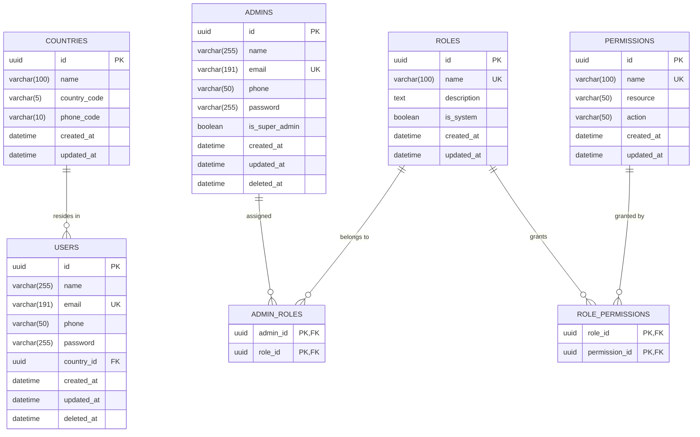
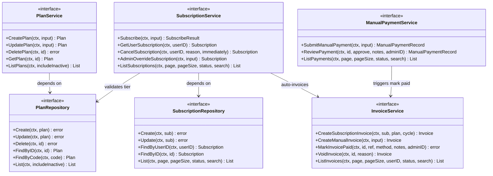
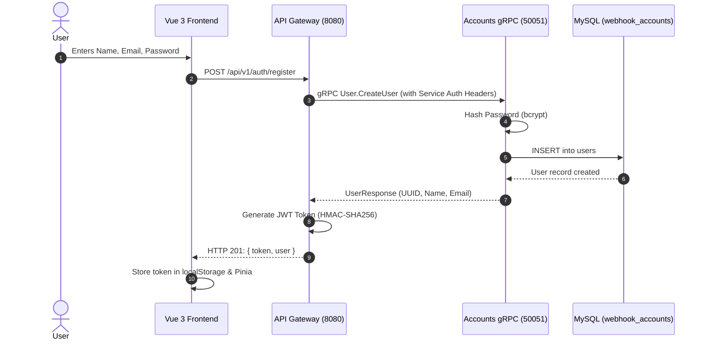
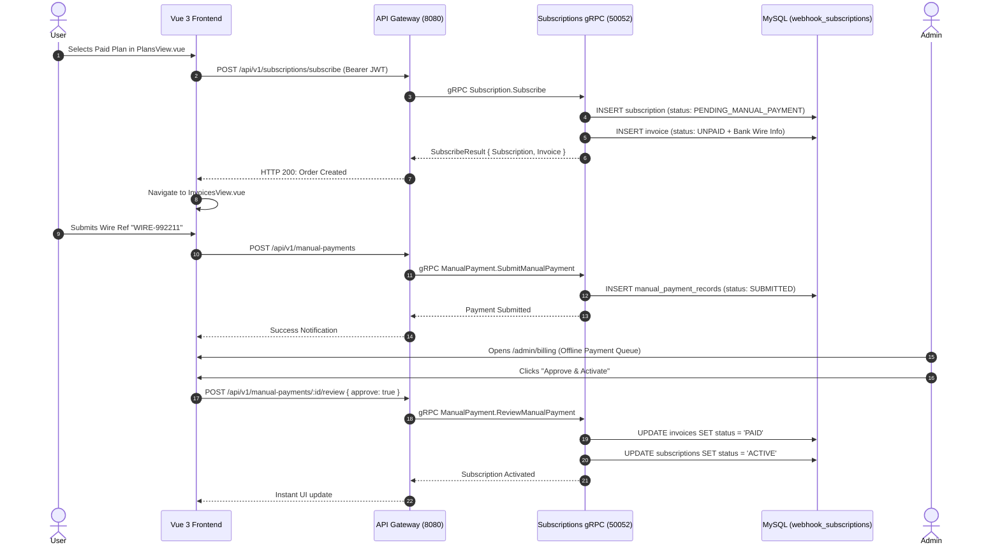

# Complete System Architecture, ERD, Class & Package Directory Map

This document provides a comprehensive technical breakdown of every microservice, module, database entity, Go struct, package boundary, and communication channel in the **Webhook & Subscription Platform**.

You can also visually open and inspect the diagram with all 8 dedicated tabs in **[architecture_diagram.drawio](file:///home/ahmed/golang/webhook-project/architecture_diagram.drawio)** using [Draw.io / diagrams.net](https://app.diagrams.net) or any Draw.io IDE extension.

---

## Table of Contents
1. [Global System Architecture & Mesh](#1-global-system-architecture--mesh)
2. [Complete Database Entity-Relationship Diagram (ERD)](#2-complete-database-entity-relationship-diagram-erd)
3. [Go Class & Interface Architecture (Clean Architecture)](#3-go-class--interface-architecture-clean-architecture)
4. [Package Architecture & Import Hierarchy](#4-package-architecture--import-hierarchy)
5. [End-to-End Workflow Pipelines & Sequence Diagrams](#5-end-to-end-workflow-pipelines--sequence-diagrams)
6. [Detailed File-by-File Directory](#6-detailed-file-by-file-directory)

---

## 1. Global System Architecture & Mesh

```
┌──────────────────────────────────────────────────────────────────────────────────┐
│                             LAYER 1: CLIENT FRONTEND                             │
│                         Vue 3 / Vite SPA (Port 5173)                             │
└────────────────────────────────────────┬─────────────────────────────────────────┘
                                         │
                                         │ HTTP/1.1 & HTTP/2 (REST / JSON)
                                         │ Authorization: Bearer <JWT_TOKEN>
                                         ▼
┌──────────────────────────────────────────────────────────────────────────────────┐
│                            LAYER 2: WEBHOOK API GATEWAY                          │
│                           Go / Gin Engine (Port 8080)                            │
│                                                                                  │
│   • Terminates client JWT tokens & injects context (userID, role)                │
│   • Injects Service Auth Headers:                                                │
│       - X-Service-Name: api-gateway                                              │
│       - Authorization: Bearer <AUTH_TOKEN>                                       │
└───────────────────────┬──────────────────────────────────┬───────────────────────┘
                        │                                  │
      gRPC (Protobuf v1)│Port 50051      gRPC (Protobuf v1)│Port 50052
                        ▼                                  ▼
┌──────────────────────────────────┐    ┌──────────────────────────────────────────┐
│    LAYER 3A: ACCOUNTS SERVICE    │    │      LAYER 3B: SUBSCRIPTIONS SERVICE     │
│   Go / gRPC Server (Port 50051)  │    │       Go / gRPC Server (Port 50052)      │
│                                  │    │                                          │
│ • User / Admin Auth & Passwords  │    │ • Plans CRUD & Feature Quotas            │
│ • Roles & Fine-Grained Perms     │    │ • Subscriptions Lifecycle & Overrides    │
│ • Country Registry               │    │ • Invoicing & Offline Bank Wire Queue    │
└────────────────┬─────────────────┘    └──────────────────┬───────────────────────┘
                 │                                         │
                 │ TCP (Port 3306)                         │ TCP (Port 3306)
                 ▼                                         ▼
┌──────────────────────────────────┐    ┌──────────────────────────────────────────┐
│      MySQL: webhook_accounts     │    │      MySQL: webhook_subscriptions        │
│                                  │    │                                          │
│ • users, admins, roles           │    │ • plans, subscriptions, invoices         │
│ • permissions, admin_roles       │    │ • invoice_items, manual_payment_records  │
└──────────────────────────────────┘    └──────────────────────────────────────────┘
```

---

## 2. Complete Database Entity-Relationship Diagram (ERD)

### Database 1: `webhook_accounts` (MySQL 8.0)


### Database 2: `webhook_subscriptions` (MySQL 8.0)
```mermaid
erDiagram
    PLANS ||--o{ SUBSCRIPTIONS : "subscribes to"
    SUBSCRIPTIONS ||--o{ INVOICES : "billed by"
    INVOICES ||--o{ INVOICE_ITEMS : "contains line items"
    INVOICES ||--o{ MANUAL_PAYMENT_RECORDS : "paid via offline wire"

    PLANS {
        uuid id PK
        varchar(50) code UK
        varchar(100) name
        text description
        decimal price_monthly
        decimal price_annually
        varchar(10) currency
        int max_webhooks
        bigint max_events_per_month
        int max_team_members
        json features
        boolean is_active
        boolean is_popular
        int tier_level
        datetime created_at
        datetime updated_at
    }

    SUBSCRIPTIONS {
        uuid id PK
        uuid user_id INDEX
        uuid plan_id FK
        varchar(50) status
        varchar(20) billing_cycle
        datetime current_period_start
        datetime current_period_end
        boolean cancel_at_period_end
        text custom_notes
        datetime created_at
        datetime updated_at
    }

    INVOICES {
        uuid id PK
        varchar(50) invoice_number UK
        uuid user_id INDEX
        uuid subscription_id FK
        decimal amount
        decimal tax
        decimal total_amount
        varchar(10) currency
        varchar(50) status
        datetime due_date
        datetime paid_at
        text bank_account_instructions
        datetime created_at
        datetime updated_at
    }

    INVOICE_ITEMS {
        uuid id PK
        uuid invoice_id FK
        varchar(255) description
        int quantity
        decimal unit_price
        decimal total
        datetime created_at
        datetime updated_at
    }

    MANUAL_PAYMENT_RECORDS {
        uuid id PK
        uuid invoice_id FK
        uuid user_id INDEX
        decimal amount
        varchar(10) currency
        varchar(100) transaction_reference
        varchar(255) payer_name
        text payer_notes
        varchar(50) status
        text admin_notes
        datetime created_at
        datetime updated_at
    }
```

---

## 3. Go Class & Interface Architecture (Clean Architecture)



---

## 4. Package Architecture & Import Hierarchy

```
webhook-project/
├── api-gateway/                      [Package: webhookApiGateway]
│   ├── cmd/server/                   --> main.go (Router bootstrap & gRPC dialing)
│   ├── internal/
│   │   ├── config/                   --> Config loading (.env & secrets)
│   │   ├── clients/                  --> AccountsClient, SubscriptionsClient
│   │   ├── middleware/               --> JWTAuth, CORS, ErrorMapper
│   │   ├── handlers/                 --> Auth, Plan, Sub, Invoice, Payment, Users, Admins
│   │   └── models/                   --> Gateway DTOs & Claims
│   └── api/proto/                    --> Generated Protobuf v1 Go Stubs
│
├── subscriptions/                    [Package: subscriptions]
│   ├── cmd/server/                   --> main.go (gRPC Server Port 50052)
│   ├── internal/
│   │   ├── config/                   --> ConnectDB, Pool Tuning (200/100), AutoMigrate
│   │   ├── middleware/               --> ServiceAuthInterceptor (Whitelist & Token)
│   │   ├── models/                   --> Plan, Subscription, Invoice, ManualPayment
│   │   ├── pkg/apperrors/            --> Sentinel domain error definitions
│   │   └── modules/
│   │       ├── plan/                 --> controller, service, repository, presenter
│   │       ├── subscription/         --> controller, service, repository, presenter
│   │       ├── invoice/              --> controller, service, repository, presenter
│   │       └── manual_payment/       --> controller, service, repository, presenter
│   └── api/proto/                    --> gRPC Protobuf definitions & generated code
│
├── accounts/                         [Package: accounts]
│   ├── cmd/server/                   --> main.go (gRPC Server Port 50051)
│   ├── internal/
│   │   ├── config/                   --> ConnectDB, Pool Tuning (200/100), AutoMigrate
│   │   ├── middleware/               --> ServiceAuthInterceptor
│   │   ├── models/                   --> User, Admin, Role, Permission, Country
│   │   └── modules/
│   │       ├── user/                 --> controller, service, repository, presenter
│   │       ├── admin/                --> controller, service, repository, presenter
│   │       ├── role/                 --> controller, service, repository, presenter
│   │       ├── permission/           --> controller, service, repository, presenter
│   │       └── country/              --> controller, service, repository, presenter
│   └── api/proto/                    --> gRPC Protobuf definitions & generated code
│
└── frontend/                         [SPA: Vue 3 + Vite]
    └── src/
        ├── views/                    --> PlansView, MySubscriptionView, InvoicesView, AdminBillingView...
        ├── components/               --> AppSidebar (RBAC), AppHeader, Modals, Drawers
        ├── stores/                   --> auth.js (isAdmin computed, JWT), toast.js
        ├── services/                 --> Axios service clients (plan, sub, invoice, payment)
        ├── router/                   --> index.js (Navigation guards & requiresAdmin meta)
        └── locales/                  --> en.js (English), ar.js (Arabic RTL)
```

---

## 5. End-to-End Workflow Pipelines & Sequence Diagrams

### Workflow 1: User Registration & Authentication


### Workflow 2: Subscription Order, Auto-Invoicing & Offline Wire Approval


---

## 6. Detailed File-by-File Directory

| File Path | Layer | Responsibility |
|---|---|---|
| [api-gateway/cmd/server/main.go](file:///home/ahmed/golang/webhook-project/api-gateway/cmd/server/main.go) | Gateway | Router setup, gRPC client initialization, middleware wiring, and HTTP server startup. |
| [api-gateway/internal/middleware/jwt_auth.go](file:///home/ahmed/golang/webhook-project/api-gateway/internal/middleware/jwt_auth.go) | Gateway | Parses & validates JWT HMAC-SHA256 signature, extracts user identity into context. |
| [api-gateway/internal/middleware/error_mapper.go](file:///home/ahmed/golang/webhook-project/api-gateway/internal/middleware/error_mapper.go) | Gateway | Normalizes gRPC error codes to standard HTTP status codes. |
| [api-gateway/internal/handlers/plan_handler.go](file:///home/ahmed/golang/webhook-project/api-gateway/internal/handlers/plan_handler.go) | Gateway | REST handlers for Public Plans listing & Admin Plans CRUD. |
| [api-gateway/internal/handlers/subscription_handler.go](file:///home/ahmed/golang/webhook-project/api-gateway/internal/handlers/subscription_handler.go) | Gateway | Handlers for user subscription order, cancellation, and admin overrides. |
| [api-gateway/internal/handlers/invoice_handler.go](file:///home/ahmed/golang/webhook-project/api-gateway/internal/handlers/invoice_handler.go) | Gateway | Handlers for user ledger, manual invoices, mark paid, and voiding. |
| [api-gateway/internal/handlers/manual_payment_handler.go](file:///home/ahmed/golang/webhook-project/api-gateway/internal/handlers/manual_payment_handler.go) | Gateway | Handlers for offline bank wire proof submission and admin verification. |
| [subscriptions/cmd/server/main.go](file:///home/ahmed/golang/webhook-project/subscriptions/cmd/server/main.go) | Subscriptions | gRPC server entry point listening on port 50052. |
| [subscriptions/internal/config/config.go](file:///home/ahmed/golang/webhook-project/subscriptions/internal/config/config.go) | Subscriptions | MySQL connection pool setup (`200 MaxOpen`, `100 MaxIdle`) and table auto-migrations. |
| [subscriptions/internal/modules/plan/](file:///home/ahmed/golang/webhook-project/subscriptions/internal/modules/plan) | Subscriptions | Business logic, repository, and controller for Plan CRUD. |
| [subscriptions/internal/modules/subscription/](file:///home/ahmed/golang/webhook-project/subscriptions/internal/modules/subscription) | Subscriptions | Subscription order state machine, free tier auto-provisioning, cancellation, and admin overrides. |
| [subscriptions/internal/modules/invoice/](file:///home/ahmed/golang/webhook-project/subscriptions/internal/modules/invoice) | Subscriptions | Automatic invoice generation on subscription, manual custom invoices, and settlement. |
| [subscriptions/internal/modules/manual_payment/](file:///home/ahmed/golang/webhook-project/subscriptions/internal/modules/manual_payment) | Subscriptions | Offline wire transfer proof submission and approval queue that activates subscriptions. |
| [accounts/cmd/server/main.go](file:///home/ahmed/golang/webhook-project/accounts/cmd/server/main.go) | Accounts | gRPC server entry point listening on port 50051. |
| [accounts/internal/config/config.go](file:///home/ahmed/golang/webhook-project/accounts/internal/config/config.go) | Accounts | MySQL connection pool setup (`200 MaxOpen`, `100 MaxIdle`) and table auto-migrations. |
| [accounts/internal/modules/user/](file:///home/ahmed/golang/webhook-project/accounts/internal/modules/user) | Accounts | User registration, password bcrypt hashing, profile retrieval, and updates. |
| [accounts/internal/modules/admin/](file:///home/ahmed/golang/webhook-project/accounts/internal/modules/admin) | Accounts | Administrator accounts and role assignment. |
| [accounts/internal/modules/role/](file:///home/ahmed/golang/webhook-project/accounts/internal/modules/role) | Accounts | Role definitions & permission join table mapping. |
| [accounts/internal/modules/permission/](file:///home/ahmed/golang/webhook-project/accounts/internal/modules/permission) | Accounts | Fine-grained atomic permission tokens. |
| [frontend/src/views/AdminBillingView.vue](file:///home/ahmed/golang/webhook-project/frontend/src/views/AdminBillingView.vue) | Frontend | Complete Admin Billing console (Payment Queue, Invoices, Subscriptions Override, and Plans CRUD). |
| [frontend/src/views/PlansView.vue](file:///home/ahmed/golang/webhook-project/frontend/src/views/PlansView.vue) | Frontend | Pricing tiers page with monthly/annual toggle and order confirmation modal. |
| [frontend/src/views/MySubscriptionView.vue](file:///home/ahmed/golang/webhook-project/frontend/src/views/MySubscriptionView.vue) | Frontend | Active plan details, quota consumption progress, bank wire info, and cancel/unsubscribe. |
| [frontend/src/views/InvoicesView.vue](file:///home/ahmed/golang/webhook-project/frontend/src/views/InvoicesView.vue) | Frontend | Billing ledger, printable statement, and offline wire proof submission modal. |
| [frontend/src/router/index.js](file:///home/ahmed/golang/webhook-project/frontend/src/router/index.js) | Frontend | Route declarations and `beforeEach` navigation guard with `requiresAdmin` protection. |
| [frontend/src/components/layout/AppSidebar.vue](file:///home/ahmed/golang/webhook-project/frontend/src/components/layout/AppSidebar.vue) | Frontend | Navigation sidebar dynamically hiding administrative links for regular users. |
| [frontend/src/stores/auth.js](file:///home/ahmed/golang/webhook-project/frontend/src/stores/auth.js) | Frontend | Pinia state management for JWT authentication, user profile, and `isAdmin` computed state. |
