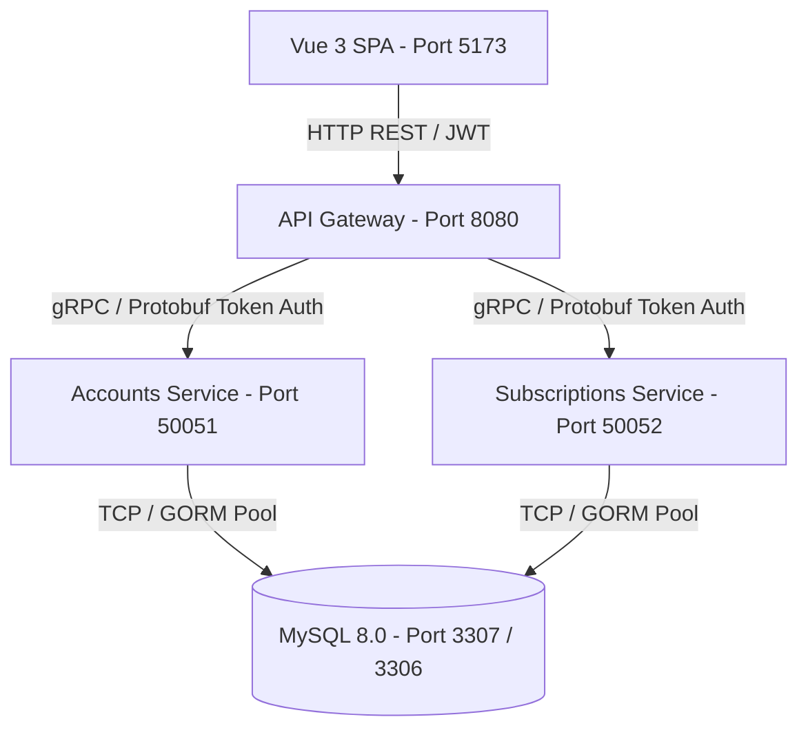

# 🚀 Webhook Microservices Ecosystem

A scalable, production-ready microservices platform for webhook ingestion, role-based account management (RBAC), multi-tier subscription billing, offline bank wire payment processing, and high-throughput API gateway routing.

---

## 🌟 Ecosystem Architecture



### 🧩 Services Breakdown

| Service | Protocol / Port | Architecture | Description |
| :--- | :--- | :--- | :--- |
| **`api-gateway`** | **HTTP REST / `8080`** | Clean Architecture / Gin | Public REST gateway, JWT auth middleware, inter-service gRPC client routing, and system health checks. |
| **`accounts`** | **gRPC / `50051`** | HMVC / GORM | User & admin identity management, RBAC (roles & granular permissions), multi-lingual countries. |
| **`subscriptions`** | **gRPC / `50052`** | HMVC / GORM | Tiered pricing plans (Free, Starter, Pro, Enterprise), subscriptions, invoices, and offline payment reviews. |
| **`frontend`** | **HTTP / `5173`** | Vue 3 + Vite + Nginx | Zoho-inspired responsive UI, 6-language internationalization (AR, EN, FR, DE, RU), and role-guarded views. |
| **`mysql`** | **TCP / `3307:3306`** | MySQL 8.0 InnoDB | Separate schemas: `webhook_accounts` and `webhook_subscriptions` with auto-migration and seeders. |

---

## 🚀 Quick Start Guide

### Option 1: Docker Compose (Recommended)

All containers are optimized with multi-stage builds (`~10 MB` to `~28 MB` runtime images) and self-contained database migrations/seeders.

```bash
# Clone the repository
git clone git@github.com:Ahmedfargh/webhook-runner.git
cd webhook-runner

# Start the entire ecosystem in the background
./docker.sh up

# (Or using standard docker-compose)
docker compose up -d --build
```

#### Docker Management Helper (`./docker.sh`)
```bash
./docker.sh up         # Start all services in the background
./docker.sh down       # Stop all running containers gracefully
./docker.sh logs       # Stream real-time logs from all services (or ./docker.sh logs accounts)
./docker.sh status     # Check container health and port mappings
./docker.sh clean      # Tear down containers, volumes, and local images
```

---

### Option 2: Local Development (Bare Metal)

Ensure you have **Go 1.22+**, **Node.js 20+**, and a running **MySQL** instance.

```bash
# 1. Start all microservices with the unified runner script
./run.sh
```

---

## 🌐 Access Endpoints

| Resource | URL | Description |
| :--- | :--- | :--- |
| **Frontend UI** | [http://localhost:5173](http://localhost:5173) | Vue 3 Web Application (Default admin: `admin@webhook.io` / `password123`) |
| **API Gateway REST** | [http://localhost:8080](http://localhost:8080) | Base REST API root (`/api/v1`) |
| **Gateway Health Probe** | [http://localhost:8080/health](http://localhost:8080/health) | Real-time upstream gRPC connectivity & latency diagnostic |
| **Accounts gRPC** | `localhost:50051` | gRPC server reflection enabled (Protobuf v1) |
| **Subscriptions gRPC** | `localhost:50052` | gRPC server reflection enabled (Protobuf v1) |
| **MySQL Database** | `localhost:3307` | Host mapped port (Database: `webhook_accounts`, `webhook_subscriptions`) |

---

## ⚙️ Environment Configuration (`.env`)

A single centralized [`.env`](file:///.env) file controls the entire ecosystem:

```ini
# Database (MySQL)
MYSQL_PORT=3307
MYSQL_ALLOW_EMPTY_PASSWORD=yes
MYSQL_ROOT_PASSWORD=
DB_HOST=mysql
DB_PORT=3306
DB_USER=root
DB_PASSWORD=

# Databases & gRPC Hosts
ACCOUNTS_DB_NAME=webhook_accounts
ACCOUNTS_GRPC_HOST=accounts
ACCOUNTS_GRPC_PORT=50051

SUBSCRIPTIONS_DB_NAME=webhook_subscriptions
SUBSCRIPTIONS_GRPC_HOST=subscriptions
SUBSCRIPTIONS_GRPC_PORT=50052

# Security & Inter-Service Whitelisting
AUTH_TOKEN=4f7f956f34bcfa0c9a55aff6b98c4e1d87e1da6d0d33f5021b5937123d7330c1
SERVICE_TOKEN=4f7f956f34bcfa0c9a55aff6b98c4e1d87e1da6d0d33f5021b5937123d7330c1
SERVICE_NAME=api-gateway
ALLOWED_SERVICES=api-gateway,webhook-runner
JWT_SECRET=api-gateway-super-secret-jwt-key-2026

# Gateway & UI
API_GATEWAY_PORT=8080
PORT=8080
ALLOWED_ORIGINS=*
FRONTEND_PORT=5173
VITE_API_URL=http://localhost:8080/api/v1
```

---

## ⚡ High-Concurrency Load Testing

The platform includes a dedicated benchmark tool [`loadtest.go`](file:///loadtest.go) capable of generating up to **100,000 requests** across multiple concurrency levels:

```bash
# Run 100,000 mixed load requests with 1,000 concurrent goroutines
go run loadtest.go -n 100000 -c 1000 -scenario mixed

# Run against a remote staging server
go run loadtest.go -url http://your-vps-ip:8080 -n 100000 -c 2000 -scenario mixed
```

### Benchmark Results (Local Laptop Benchmark)
- **Total Requests**: 100,000
- **Throughput**: **~6,570 Requests / Second (RPS)**
- **P50 Latency**: `125.8 ms`
- **P99 Latency**: `514.3 ms`
- **Failure Analysis**: Auto-exports failed requests and reason distributions to `loadtest_failures.txt` and `loadtest_report.json`.

---

## 📂 Project Structure

```text
├── accounts/                  # Accounts gRPC microservice (Users, Admins, RBAC)
│   ├── api/proto/v1/          # Protocol Buffer definitions
│   ├── cmd/server/            # Server entrypoint
│   ├── internal/config/       # DB connection pool & auto-migrations
│   ├── internal/models/       # GORM models (User, Admin, Role, Permission, Country)
│   ├── internal/modules/      # HMVC modules (controller, service, repository, presenter)
│   └── internal/seeders/      # Embedded JSON seeders (//go:embed)
│
├── subscriptions/             # Subscriptions & Billing gRPC microservice
│   ├── api/proto/v1/          # Protocol Buffer definitions (Plan, Subscription, Invoice)
│   ├── cmd/server/            # Server entrypoint
│   ├── internal/config/       # DB connection pool & auto-migrations
│   ├── internal/models/       # GORM models (Plan, Subscription, Invoice, ManualPayment)
│   └── internal/modules/      # HMVC modules (plan, subscription, invoice, manual_payment)
│
├── api-gateway/               # HTTP REST API Gateway
│   ├── cmd/server/            # Gin REST server entrypoint
│   ├── internal/clients/      # gRPC client wrappers with auth metadata interceptors
│   ├── internal/handlers/     # REST controllers (Auth, Plans, Users, Billing, Topology)
│   └── internal/middleware/   # JWT authentication & CORS
│
├── frontend/                  # Vue 3 SPA frontend
│   ├── src/components/        # Layout and reusable UI components
│   ├── src/locales/           # i18n localization dictionaries (AR, EN, FR, DE, RU)
│   ├── src/router/            # Route navigation guards (RBAC requiresAdmin)
│   ├── src/services/          # Axios HTTP clients for all Gateway endpoints
│   ├── src/stores/            # Pinia stores (auth, toast)
│   └── src/views/             # Views (Plans, Subscriptions, Invoices, Admin Billing, Topology)
│
├── docker/                    # Docker initialization scripts (MySQL schema init)
├── docker-compose.yml         # Container ecosystem definition
├── docker.sh                  # Docker management CLI tool
├── loadtest.go                # High-performance Go load tester & failure logger
├── ARCHITECTURE_MAP.md        # Comprehensive Mermaid ERDs & Class diagrams
└── architecture_diagram.drawio # Multi-tab visual Draw.io diagrams
```

---

## 📊 Visual Documentation

- **Interactive Visual Architecture**: Open [`architecture_diagram.drawio`](file:///architecture_diagram.drawio) in [draw.io](https://app.diagrams.net) for 8 detailed tabs:
  1. *System Overview & Mesh*
  2. *Database ERD (All Schemas)*
  3. *Go Structs & Clean Architecture Class Diagram*
  4. *Package Architecture & Import Hierarchy*
  5. *API Gateway REST Routes*
  6. *Subscriptions Microservice*
  7. *Accounts Microservice*
  8. *Vue 3 Frontend & RBAC Router State*
- **Mermaid Reference Map**: See [`ARCHITECTURE_MAP.md`](file:///ARCHITECTURE_MAP.md) for full Markdown-rendered entity relationship diagrams and execution flows.

---

## 📄 License

This project is licensed under the MIT License.
