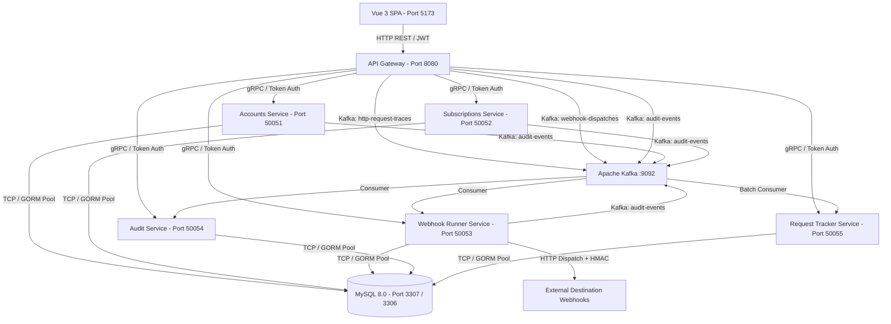
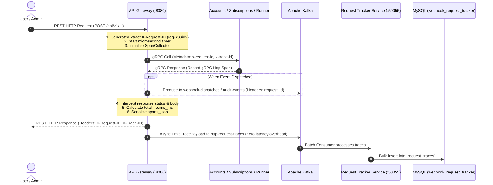

# 🚀 Webhook Microservices Ecosystem

A scalable, production-ready microservices platform for webhook ingestion, role-based account management (RBAC), multi-tier subscription billing, offline bank wire payment processing, and high-throughput API gateway routing.

---

## 🌟 Ecosystem Architecture



### 🧩 Services Breakdown

| Service | Protocol / Port | Architecture | Description |
| :--- | :--- | :--- | :--- |
| **`api-gateway`** | **HTTP REST / `8080`** | Clean Architecture / Gin | Public REST gateway, JWT auth termination, multi-protocol unique request ID generator (`req-<uuid>`), and inter-service gRPC routing. |
| **`request-tracker-service`** | **gRPC / `50055` + Kafka** | Event-Driven / GORM | Real-time APM telemetry service, batch Kafka consumer (`http-request-traces`), request lifetime calculations, and multi-hop trip waterfalls. |
| **`audit-service`** | **gRPC / `50054` + Kafka** | Event-Driven / GORM | Immutable audit logging, Kafka consumer (`audit-events`), before/after mutation diffs, actor attribution, and compliance query RPCs. |
| **`webhook-runner`** | **gRPC / `50053` + Kafka** | HMVC / GORM / Engine | Applications management (`App`), HMAC-SHA256 crypto signing, HTTP dispatch engine, retry lifecycles, and execution telemetry logs. |
| **`accounts`** | **gRPC / `50051`** | HMVC / GORM | User & admin identity management, RBAC (roles & granular permissions), multi-lingual countries, and audit emitter. |
| **`subscriptions`** | **gRPC / `50052`** | HMVC / GORM | Tiered pricing plans (Free, Starter, Pro, Enterprise), subscriptions lifecycle, tax-compliant invoicing, and offline bank wire approvals. |
| **`frontend`** | **HTTP / `5173`** | Vue 3 + Vite + Nginx | Zoho-inspired responsive UI, 6-language internationalization (AR, EN, FR, DE, RU), Request Traces APM inspector, and Audit trails. |
| **`kafka`** | **TCP / `9092`** | Apache Kafka | Distributed event streaming for `http-request-traces`, `webhook-dispatches`, and `audit-events`. |
| **`mysql`** | **TCP / `3307:3306`** | MySQL 8.0 InnoDB | Schemas: `webhook_accounts`, `webhook_subscriptions`, `webhook_runner`, `webhook_audit`, `webhook_request_tracker`. |

---

## 🚀 Quick Start Guide

### Option 1: Docker Compose (Recommended)

All containers are optimized with multi-stage builds (`~10 MB` to `~28 MB` runtime images) and self-contained database migrations/seeders.

```bash
# Clone the repository
git clone git@github.com:Ahmedfargh/webhook-runner.git
cd webhook-runner

# Start the entire ecosystem in the background
./docker.sh up

# (Or using standard docker-compose)
docker compose up -d --build
```

#### Docker Management Helper (`./docker.sh`)
```bash
./docker.sh up         # Start all services in the background
./docker.sh down       # Stop all running containers gracefully
./docker.sh logs       # Stream real-time logs from all services (or ./docker.sh logs accounts)
./docker.sh status     # Check container health and port mappings
./docker.sh clean      # Tear down containers, volumes, and local images
```

---

### Option 2: Local Development (Bare Metal)

Ensure you have **Go 1.22+**, **Node.js 20+**, and a running **MySQL** instance.

```bash
# 1. Start all microservices with the unified runner script
./run.sh
```

---

## 🌐 Access Endpoints

| Resource | URL | Description |
| :--- | :--- | :--- |
| **Frontend UI** | [http://localhost:5173](http://localhost:5173) | Vue 3 Web Application (Default admin: `admin@webhook.io` / `password123`) |
| **API Gateway REST** | [http://localhost:8080](http://localhost:8080) | Base REST API root (`/api/v1`) |
| **Gateway Health Probe** | [http://localhost:8080/health](http://localhost:8080/health) | Real-time upstream gRPC connectivity & latency diagnostic (all 5 microservices) |
| **Built-in Mock Webhook Receiver** | [http://localhost:8080/api/v1/webhooks/test-receiver](http://localhost:8080/api/v1/webhooks/test-receiver) | Built-in local mock endpoint for testing HMAC webhook delivery |
| **Accounts gRPC** | `localhost:50051` | Identity, Auth & RBAC (Protobuf v1 reflection enabled) |
| **Subscriptions gRPC** | `localhost:50052` | Plans, Billing & Invoicing (Protobuf v1 reflection enabled) |
| **Webhook Runner gRPC** | `localhost:50053` | Webhook Dispatch Engine & Logs (Protobuf v1 reflection enabled) |
| **Audit Service gRPC** | `localhost:50054` | Compliance Audit Logs Query & Ingestion (Protobuf v1 reflection enabled) |
| **Request Tracker gRPC** | `localhost:50055` | Real-time APM Traces, Spans & Latency Percentiles |
| **Apache Kafka** | `localhost:9092` | Topics: `http-request-traces`, `audit-events`, `webhook-dispatches` |
| **MySQL Database** | `localhost:3307` | Host mapped port (`webhook_accounts`, `webhook_subscriptions`, `webhook_runner`, `webhook_audit`, `webhook_request_tracker`) |

---

## ⚡ Webhook Dispatching & Testing

### 1. Built-in Local Test Receiver
The platform includes a built-in webhook receiver mock endpoint for local development:
- `POST http://localhost:8080/api/v1/webhooks/test-receiver`
- `POST http://localhost:8080/webhooks/test-receiver`

It automatically reads and confirms HMAC-SHA256 headers (`X-Webhook-Signature`, `X-Webhook-ID`, `X-Webhook-Event`, `X-Webhook-Timestamp`) and returns `HTTP 200 OK`.

### 2. Dispatches with URL Query Parameters
You can dispatch webhooks via POST or GET using URL Query Parameters:
```bash
curl -X POST "http://localhost:8080/api/v1/webhooks/send?app_id=app_live_f4735ddda2a5383c65de1cfb&event_name=order.created&target_url_override=http://localhost:8080/api/v1/webhooks/test-receiver" \
  -H "Authorization: Bearer <YOUR_JWT_TOKEN>"
```

### 3. Per-App Webhook Logs Modal
On the **Applications (`/apps`)** page in the UI, click **`سجلات الويب هوك` (Webhook Logs)** on any application to open live delivery traces, latency statistics, HMAC headers, and expandable payload details.

---

## 🔍 End-to-End APM Request Tracing & Multi-Protocol Trips

The platform includes a dedicated **Application Performance Monitoring (APM)** pipeline that records the lifecycle and multi-hop journey of every incoming HTTP request:



### Key Tracking Capabilities:
- **Unique Distributed ID**: `X-Request-ID` is assigned at gateway ingress and propagated across REST response headers, gRPC metadata (`x-request-id`), and Kafka message headers (`request_id`).
- **Complete Journey Waterfall**: Visualized in the Vue 3 Frontend (`/request-traces`) showing exact time spent in Gateway Ingress $\rightarrow$ Downstream gRPC calls $\rightarrow$ Kafka event dispatches $\rightarrow$ Gateway Egress.
- **Payload Sanitization**: Incoming request bodies and outgoing responses are captured with passwords, tokens, and secrets automatically masked.

---

## ⚙️ Environment Configuration (`.env`)

A single centralized [`.env`](file:///.env) file controls the entire ecosystem:

```ini
# Database (MySQL)
MYSQL_PORT=3307
MYSQL_ALLOW_EMPTY_PASSWORD=yes
MYSQL_ROOT_PASSWORD=
DB_HOST=mysql
DB_PORT=3306
DB_USER=root
DB_PASSWORD=

# Databases & gRPC Hosts
ACCOUNTS_DB_NAME=webhook_accounts
ACCOUNTS_GRPC_HOST=accounts
ACCOUNTS_GRPC_PORT=50051

SUBSCRIPTIONS_DB_NAME=webhook_subscriptions
SUBSCRIPTIONS_GRPC_HOST=subscriptions
SUBSCRIPTIONS_GRPC_PORT=50052

# Security & Inter-Service Whitelisting
AUTH_TOKEN=4f7f956f34bcfa0c9a55aff6b98c4e1d87e1da6d0d33f5021b5937123d7330c1
SERVICE_TOKEN=4f7f956f34bcfa0c9a55aff6b98c4e1d87e1da6d0d33f5021b5937123d7330c1
SERVICE_NAME=api-gateway
ALLOWED_SERVICES=api-gateway,webhook-runner
JWT_SECRET=api-gateway-super-secret-jwt-key-2026

# Gateway & UI
API_GATEWAY_PORT=8080
PORT=8080
ALLOWED_ORIGINS=*
FRONTEND_PORT=5173
VITE_API_URL=http://localhost:8080/api/v1
```

---

## ⚡ High-Concurrency Load Testing

The platform includes a dedicated benchmark tool [`loadtest.go`](file:///loadtest.go) capable of generating up to **100,000 requests** across multiple concurrency levels:

```bash
# Run 100,000 mixed load requests with 1,000 concurrent goroutines
go run loadtest.go -n 100000 -c 1000 -scenario mixed

# Run against a remote staging server
go run loadtest.go -url http://your-vps-ip:8080 -n 100000 -c 2000 -scenario mixed
```

### 💻 Test Device & Benchmark Environment

The benchmark below was conducted on the following development machine:

| Component | Specification | Description / Status |
| :--- | :--- | :--- |
| **Operating System** | **Arch Linux (x86_64)** | Kernel `7.1.8-zen1-3-zen` (ZEN SMP PREEMPT_DYNAMIC) |
| **Processor (CPU)** | **Intel(R) Core(TM) i7-8850H @ 2.60GHz** | **6 Cores / 12 Logical Threads** |
| **System Memory (RAM)** | **16 GB Total** | ~4.1 GB Available / dynamically allocated buffer cache |
| **Network Target** | `http://localhost:8080` | Local Docker Bridge Network & Loopback Socket |
| **Test Scenario** | `mixed` | Read/Write mix: Auth Login, Plans Listing, User Profiles, Health |

---

### 📊 Benchmark Results (100,000 Requests @ 1,000 Concurrency)

```text
=======================================================
           🏁 LOAD TEST BENCHMARK RESULTS             
=======================================================
 Total Requests:     100,000
 Concurrency:        1,000 Parallel Goroutines
 Total Duration:     15.22s
 Throughput:         6,570.19 Requests / Second (RPS)
 Server 500 Errors:  0 (0.00%)
-------------------------------------------------------
 ⚡ Latency Breakdown:
   - Average:        145.29 ms
   - Min:            1.20 ms
   - P50 (Median):   125.81 ms
   - P90:            260.15 ms
   - P95:            325.93 ms
   - P99:            514.36 ms
   - Max:            3,371.18 ms
-------------------------------------------------------
 📋 Failure Logging:
   - Auto-exports failure breakdown to `loadtest_failures.txt`
   - Generates JSON summary report in `loadtest_report.json`
=======================================================
```

> **Note on High Concurrency & Production VPS Tuning:**  
> When scaling beyond 5,000+ concurrent connections on cloud servers (such as **Hostinger KVM 4 VPS** with 4 vCPU / 16 GB RAM), optimize Linux socket buffers (`ulimit -n 65535`, `sysctl -w net.core.somaxconn=4096`) and ensure MySQL `max_connections >= 2000` with connection pool limits (`SetMaxOpenConns(200)`).

---

## 📂 Project Structure

```text
├── accounts/                  # Accounts gRPC microservice (Users, Admins, RBAC)
│   ├── api/proto/v1/          # Protocol Buffer definitions
│   ├── cmd/server/            # Server entrypoint
│   ├── internal/config/       # DB connection pool & auto-migrations
│   ├── internal/models/       # GORM models (User, Admin, Role, Permission, Country)
│   ├── internal/modules/      # HMVC modules (controller, service, repository, presenter)
│   └── internal/seeders/      # Embedded JSON seeders (//go:embed)
│
├── subscriptions/             # Subscriptions & Billing gRPC microservice
│   ├── api/proto/v1/          # Protocol Buffer definitions (Plan, Subscription, Invoice)
│   ├── cmd/server/            # Server entrypoint
│   ├── internal/config/       # DB connection pool & auto-migrations
│   ├── internal/models/       # GORM models (Plan, Subscription, Invoice, ManualPayment)
│   └── internal/modules/      # HMVC modules (plan, subscription, invoice, manual_payment)
│
├── api-gateway/               # HTTP REST API Gateway
│   ├── cmd/server/            # Gin REST server entrypoint
│   ├── internal/clients/      # gRPC client wrappers with auth metadata interceptors
│   ├── internal/handlers/     # REST controllers (Auth, Plans, Users, Billing, Topology)
│   └── internal/middleware/   # JWT authentication & CORS
│
├── frontend/                  # Vue 3 SPA frontend
│   ├── src/components/        # Layout and reusable UI components
│   ├── src/locales/           # i18n localization dictionaries (AR, EN, FR, DE, RU)
│   ├── src/router/            # Route navigation guards (RBAC requiresAdmin)
│   ├── src/services/          # Axios HTTP clients for all Gateway endpoints
│   ├── src/stores/            # Pinia stores (auth, toast)
│   └── src/views/             # Views (Plans, Subscriptions, Invoices, Admin Billing, Topology)
│
├── docker/                    # Docker initialization scripts (MySQL schema init)
├── docker-compose.yml         # Container ecosystem definition
├── docker.sh                  # Docker management CLI tool
├── loadtest.go                # High-performance Go load tester & failure logger
├── ARCHITECTURE_MAP.md        # Comprehensive Mermaid ERDs & Class diagrams
└── architecture_diagram.drawio # Multi-tab visual Draw.io diagrams
```

---

## 📊 Visual Documentation

- **Interactive Visual Architecture**: Open [`architecture_diagram.drawio`](file:///architecture_diagram.drawio) in [draw.io](https://app.diagrams.net) for 8 detailed tabs:
  1. *System Overview & Mesh*
  2. *Database ERD (All Schemas)*
  3. *Go Structs & Clean Architecture Class Diagram*
  4. *Package Architecture & Import Hierarchy*
  5. *API Gateway REST Routes*
  6. *Subscriptions Microservice*
  7. *Accounts Microservice*
  8. *Vue 3 Frontend & RBAC Router State*
- **Mermaid Reference Map**: See [`ARCHITECTURE_MAP.md`](file:///ARCHITECTURE_MAP.md) for full Markdown-rendered entity relationship diagrams and execution flows.

---

## 📄 License

This project is licensed under the MIT License.
