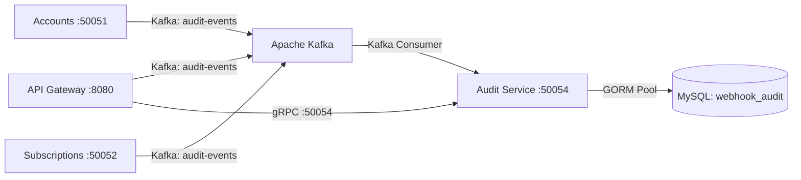

# Audit Microservice

Event-driven audit logging and compliance microservice written in Go, GORM, Protobuf, and Apache Kafka. Captures critical mutations, authentication events, and administrative overrides across all platform services.

---

## 🏛 Architecture Overview



### Key Highlights:
1. **Asynchronous Ingestion via Kafka**:
   - All microservices (`api-gateway`, `accounts`, `subscriptions`) emit structured audit records to topic `audit-events`.
   - The user actions remain non-blocking without write contention.
2. **Immutable Audit Trail**:
   - Stores `before_json` and `after_json` diffs, client IP, actor identity, action type, and status in the `audit_logs` table.
3. **gRPC Query Layer**:
   - Exposes `AuditService` on port `50054` for querying, filtering by actor/action/resource, and displaying audit records in the admin dashboard.

---

## 🔐 Security & Service Whitelisting

Requires incoming gRPC metadata:
```
authorization: Bearer <AUTH_TOKEN>
x-service-name: api-gateway
```

Calls from unauthorized services are rejected.

---

## 📊 Database Schema (`webhook_audit`)

### Table: `audit_logs`
| Column | Type | Description |
| :--- | :--- | :--- |
| `id` | `VARCHAR(64)` [PK] | Audit event UUID |
| `actor_id` | `VARCHAR(64)` [INDEX] | User / Admin ID responsible for action |
| `actor_type` | `VARCHAR(32)` [INDEX] | `USER`, `ADMIN`, `SYSTEM`, or `SERVICE` |
| `actor_name` | `VARCHAR(128)` | Identity display name |
| `actor_email` | `VARCHAR(128)` [INDEX] | Identity email address |
| `service_name` | `VARCHAR(64)` [INDEX] | Originating service name |
| `action` | `VARCHAR(64)` [INDEX] | `CREATE`, `UPDATE`, `DELETE`, `LOGIN`, `OVERRIDE` |
| `resource` | `VARCHAR(64)` [INDEX] | `USER`, `ADMIN`, `ROLE`, `PLAN`, `SUBSCRIPTION` |
| `resource_id` | `VARCHAR(64)` [INDEX] | Target entity identifier |
| `before_json` | `TEXT` | Entity state before mutation |
| `after_json` | `TEXT` | Entity state after mutation |
| `ip_address` | `VARCHAR(64)` | Client IP address |
| `user_agent` | `VARCHAR(512)` | Client device user-agent |
| `status` | `VARCHAR(32)` | `SUCCESS` or `FAILED` |
| `error_message` | `TEXT` | Failure explanation if unsuccessful |
| `created_at` | `DATETIME(3)` [INDEX] | Timestamp of audit event |

---

## 📡 gRPC Service Definition

Defined in `api/proto/v1/audit.proto`:

```protobuf
service AuditService {
  rpc RecordAuditLog (RecordAuditLogRequest) returns (RecordAuditLogResponse);
  rpc ListAuditLogs (ListAuditLogsRequest) returns (ListAuditLogsResponse);
  rpc GetAuditLog (GetAuditLogRequest) returns (GetAuditLogResponse);
}
```

---

## 🚀 Running the Service

### 1. Configuration
Environment variables in `.env`:
```env
DB_HOST=127.0.0.1
DB_PORT=3307
DB_USER=root
DB_PASSWORD=secret
DB_NAME=webhook_audit
GRPC_PORT=50054
KAFKA_BROKERS=localhost:9092
KAFKA_TOPIC_AUDIT=audit-events
KAFKA_CONSUMER_GROUP=audit-service-group
AUTH_TOKEN=webhook-accounts-secret-token
ALLOWED_SERVICES=api-gateway,webhook-runner
```

### 2. Run Locally
```bash
cd audit-service
go run cmd/server/main.go
```
The service will auto-migrate `audit_logs`, start consuming from Kafka, and listen on port `50054`.
