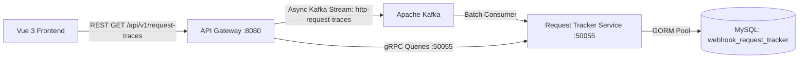

# Request Tracker Microservice

High-performance, event-driven gRPC telemetry and APM microservice written in Go, GORM, Protobuf, and Kafka. Tracks every HTTP request entering the ecosystem from ingress through its entire multi-hop lifecycle (REST ⇄ gRPC ⇄ Kafka ⇄ REST Egress).

---

## 🏛 Architecture Overview



### Key Architectural Pillars:
1. **Zero-Latency Ingress Ingestion**:
   - Telemetry traces are emitted asynchronously via Kafka (`http-request-traces`) with buffered channels in the API Gateway.
   - User and admin requests experience zero synchronous storage overhead.
2. **Micro-Batch Kafka Processing**:
   - Consumes Kafka messages in adaptive batches (up to 100 messages or every 100ms) with bulk SQL inserts for maximum throughput under heavy load.
3. **Synchronous Query Serving via gRPC**:
   - Implements `RequestTrackerService` on port `50055` for real-time querying, paginated filtering, single-trace snapshots, and latency percentiles (P95/P99).
4. **End-to-End Multi-Hop Trip Tracking**:
   - Collects and parses `spans_json` to reconstruct the complete journey of each request across REST, gRPC downstream services, and Kafka event dispatches.

---

## 🔐 Authentication & Zero-Trust Security

All gRPC RPC methods (except reflection) require standard service authorization metadata:
```
authorization: Bearer <AUTH_TOKEN>
x-service-name: api-gateway
```

Requests lacking valid tokens or callers not in `ALLOWED_SERVICES` are rejected with `codes.Unauthenticated` or `codes.PermissionDenied`.

---

## 📊 Database Schema (`webhook_request_tracker`)

### Table: `request_traces`
| Column | Type | Description |
| :--- | :--- | :--- |
| `id` | `VARCHAR(64)` [PK] | Internal unique trace primary key (UUID) |
| `trace_id` | `VARCHAR(128)` [INDEX] | Distributed correlation ID (`req-<uuid>`) |
| `request_id` | `VARCHAR(128)` [INDEX] | Client-facing correlation ID |
| `actor_type` | `VARCHAR(32)` [INDEX] | `ADMIN`, `USER`, or `ANONYMOUS` |
| `actor_id` | `VARCHAR(64)` [INDEX] | Authenticated user or admin ID |
| `actor_name` | `VARCHAR(128)` | Identity display name |
| `actor_email` | `VARCHAR(128)` [INDEX] | Identity email address |
| `actor_role` | `VARCHAR(64)` | Assigned role (`admin`, `super_admin`, `user`) |
| `service_name` | `VARCHAR(64)` | Gateway or emitting service name (`api-gateway`) |
| `method` | `VARCHAR(16)` [INDEX] | HTTP Method (`GET`, `POST`, `PUT`, `DELETE`) |
| `path` | `VARCHAR(512)` | Full URL path requested |
| `route` | `VARCHAR(256)` [INDEX] | Matched route template (`/api/v1/admin/plans/:id`) |
| `query_params` | `TEXT` | Raw query string parameters |
| `client_ip` | `VARCHAR(64)` [INDEX] | Client origin IP address |
| `user_agent` | `VARCHAR(512)` | Client browser / device user-agent string |
| `status_code` | `INT` [INDEX] | HTTP Response status code (`200`, `201`, `400`, `500`) |
| `lifetime_ms` | `DOUBLE` [INDEX] | **Total request lifetime in the system (ms)** |
| `request_body` | `MEDIUMTEXT` | Sanitized incoming request body |
| `response_body`| `MEDIUMTEXT` | Sanitized response payload (capped at 8KB) |
| `error_message`| `TEXT` | Internal handler or validation error trace |
| `spans_json` | `LONGTEXT` | Serialized JSON array of multi-hop trip spans |
| `received_at` | `DATETIME(3)` [INDEX] | Ingress timestamp (UTC) |
| `completed_at` | `DATETIME(3)` | Egress timestamp (UTC) |

---

## 📡 gRPC Service Definition

Defined in [request_tracker.proto](file:///home/ahmed/golang/webhook-project/request-tracker-service/api/proto/v1/request_tracker.proto):

```protobuf
service RequestTrackerService {
  rpc RecordTrace (RecordTraceRequest) returns (RecordTraceResponse);
  rpc ListTraces (ListTracesRequest) returns (ListTracesResponse);
  rpc GetTrace (GetTraceRequest) returns (GetTraceResponse);
  rpc GetTraceStats (GetTraceStatsRequest) returns (GetTraceStatsResponse);
}
```

---

## 🚀 Running the Service

### 1. Configuration
Environment variables in `.env`:
```env
DB_HOST=127.0.0.1
DB_PORT=3307
DB_USER=root
DB_PASSWORD=secret
DB_NAME=webhook_request_tracker
GRPC_PORT=50055
KAFKA_BROKERS=localhost:9092
KAFKA_TOPIC_REQUEST_TRACES=http-request-traces
KAFKA_CONSUMER_GROUP=request-tracker-group
AUTH_TOKEN=webhook-accounts-secret-token
ALLOWED_SERVICES=api-gateway,webhook-runner
```

### 2. Run Locally
```bash
cd request-tracker-service
go run cmd/server/main.go
```
The service will auto-migrate the `request_traces` table, start the Kafka batch consumer in the background, and bind the gRPC server to port `50055`.

### 3. Run with Docker
```bash
docker build -t webhook-request-tracker-service .
```
Or via `docker-compose.yml` (`request-tracker-service` container).
